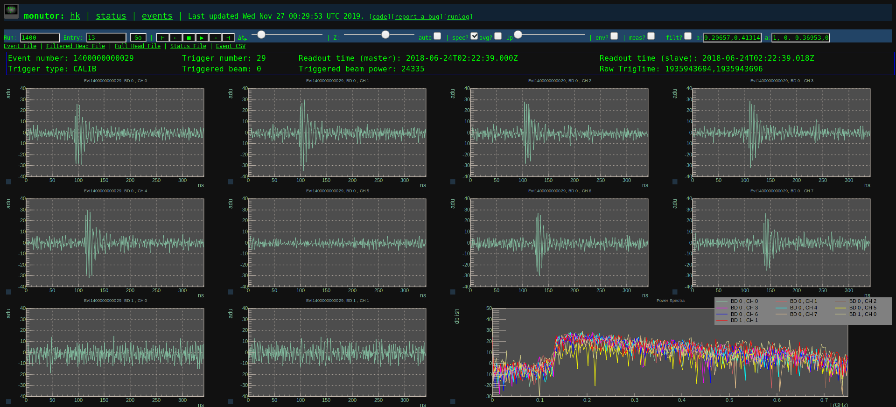

# monutor  - jsROOT-based monitor for nuphase

Instructions: 

  Whenever invoked, monutor will process new data and generate an updated static monitoring page. 

  monutor uses GNU make to process new files and generate pages. 

  To run, you need a site.cfg file in this directory. Some examples in the cfg directory

  If you are processing raw data,  `libnuphase` and `nuphaseroot` are required and `nuphaseroot-convert` must be in a path (it's called to generate ROOT files). `nuphaseroot` may be obtained from https://github.com/vPhase/nuphaseroot and `libnuphase` from https://github.com/vPhase/libnuphase 

The monitoring web page reads the ROOT files directly using `jsroo`t, which is included as a submodule in this repository (you will need to remember to initialize submodules). A fork of `monutor` for BEACON with somewhat more features is available at https://github.com/beaconTau/monutau . Those features will be backported at some point.  
  

